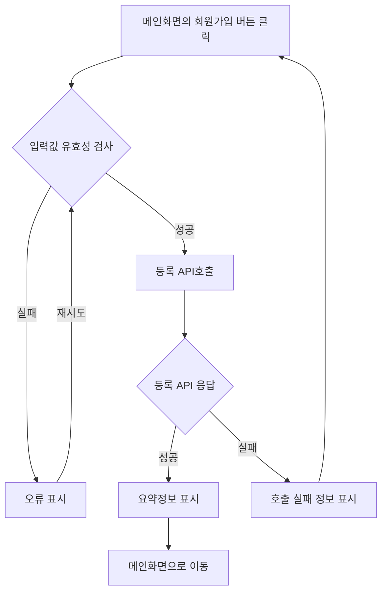
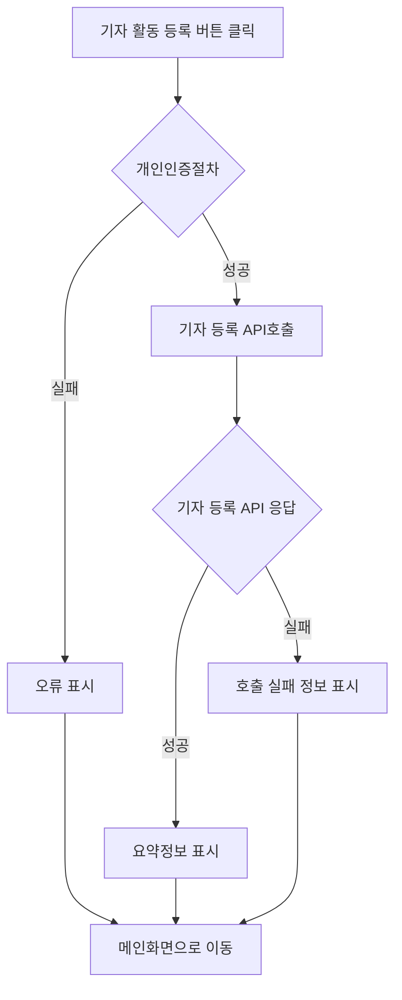
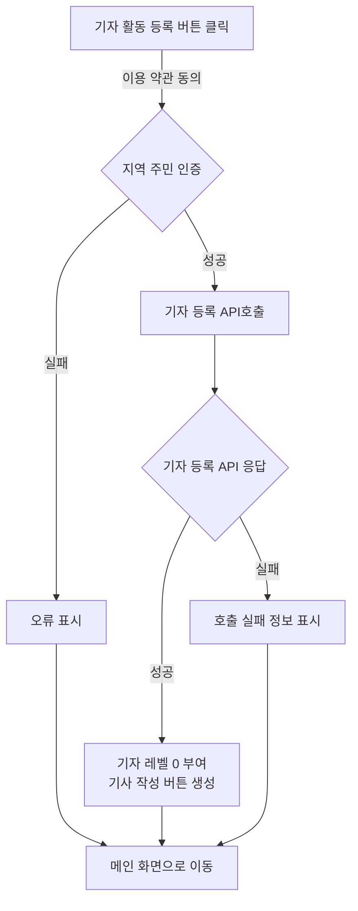
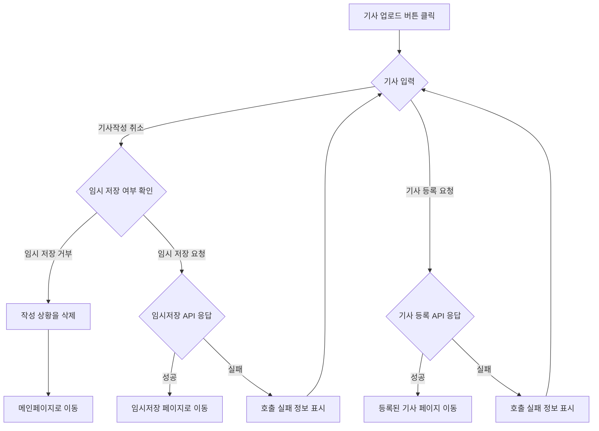

# 기능 정의서

프로젝트 정의서의 사용자 스토리를 기반으로 세부 기능을 구체적으로 정의합니다.

## 직원 등록 사용자 스토리

### 인사부서 직원으로서, 나는 새로운 직원을 등록하고 싶습니다. 그래서 회사의 직원 정보를 최신 상태로 유지할 수 있습니다.

#### 1. 기능명: 직원 등록

* 기능 설명
  * 인사부서 직원이 새로운 직원을 시스템에 등록하여 회사의 직원 정보를 최신 상태로 유지할 수 있다.
* 입력 항목
  * 직원 ID: 고유 식별자 (자동 생성)
  * 이름: 문자열, 최대 50자
  * 주민등록번호: 문자열, 13자 (유효성 검사 필요)
  * 연락처: 문자열, 최대 15자 (유효성 검사 필요)
  * 이메일: 문자열, 최대 50자 (유효성 검사 필요)
  * 주소: 문자열, 최대 100자
  * 부서: 선택형 목록 (프론트엔드에서 제공)
  * 직급: 선택형 목록 (프론트엔드에서 제공)
  * 입사일: 날짜 (yyyy-mm-dd 형식)

##### 1.1 사용자 액션

##### 등록

* 등록 버튼 클릭
  * 입력 항목 유효성 검사 실행
  * 유효성 검사 오류 발생시 등록 절차는 종료되며 사용자에게 오류 정보 알림
  * 유효성 검사 통과시 등록 API 호출
  * API 호출 성공 후 요약 정보 표시
  * 직원 목록 화면으로 전환

사용자 액선 1번(일반회원)

사용자 액선 1번(기자등급 회원)

사용자 액선 1번(기자등급 회원) - 수정

사용자 액션 2번

사용자 액션 3번 -수정본
