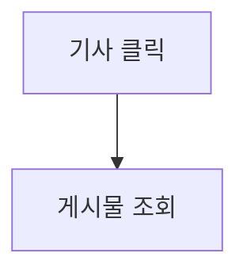
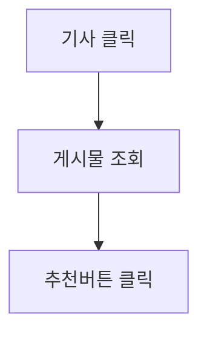
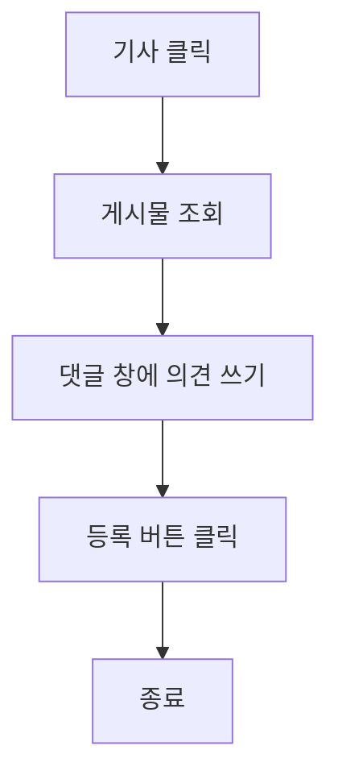
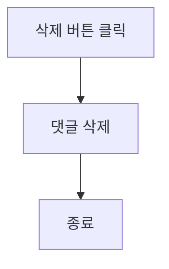
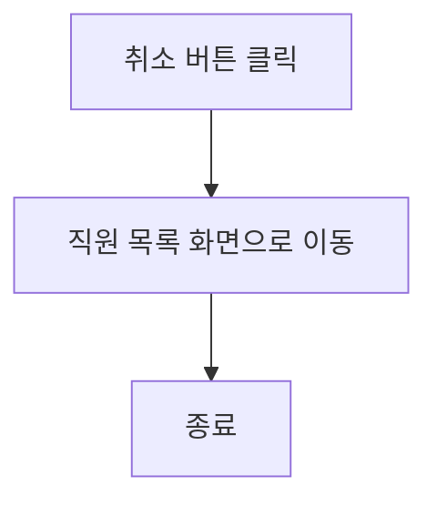

# 기능 정의서

프로젝트 정의서의 사용자 스토리를 기반으로 세부 기능을 구체적으로 정의합니다.

## 추천 기사 사용자( 독자 / 기자 ) 스토리

### (독자) 우리 지역 최신 이슈를 놓치고 싶지 않아요. 다음날 조간신문 보듯이 이슈를 한 곳에 모아 놓은 뉴스를 보고 있습니다.

### (기자) 지역 이슈를 공유하다 보니 조간신문 핫 이슈 5에 선정되어 수익이 발생했어요. 더 좋은 이슈를 발굴하고자 노력하게 되었습니다

#### 1. 기능명: 추천 기사 선정 기능

- 기능 설명
  - 조간신문에는 지역 광고를 받은 수익 창출, 수익을 선정된 기사의 작성자와 공유한다.
  - 플랫폼 독자와 상호 작용되는 조회수,추천,코멘트 수를 고려하여 선별한 5개의 기사를 선정한다.
- 입력 항목
  - 조회수: 숫자 +1(중복 카운트)
  - 추천: 숫자 +1(비중복 카운트)
  - 코멘트: 문자열, 최대 100자
  - 기사 공유: 숫자 +1(비중복 카운트)

##### 1.1 사용자 액션

##### 기사 클릭

- 게시물 조회

##### 추천하기

- 추천 버튼 클릭

##### 코멘트 하기

- 코멘트 창에 의견 쓰기
- 의견 등록
- 의견 삭제

- 댓글 삭제 버튼 클릭
  - 댓글 삭제

##### 기사 공유 하기

- 공유하기 버튼 클릭
- URL 복사 / SNS 연동 버튼 클릭

##### 추천 기사 노출

- 조간 신문 형식으로 메인 노출

---

- 취소 버튼 클릭
  - 직원 목록 화면으로 전환

