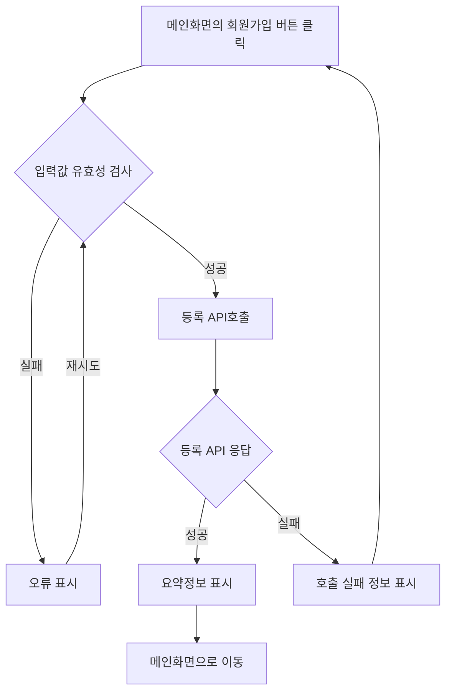
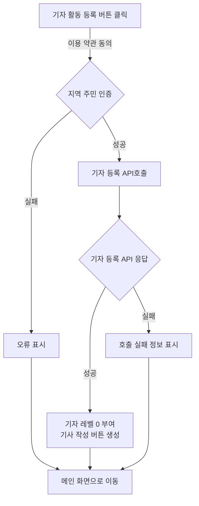
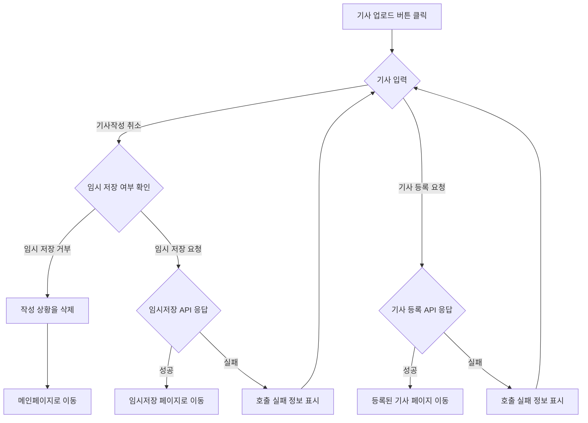
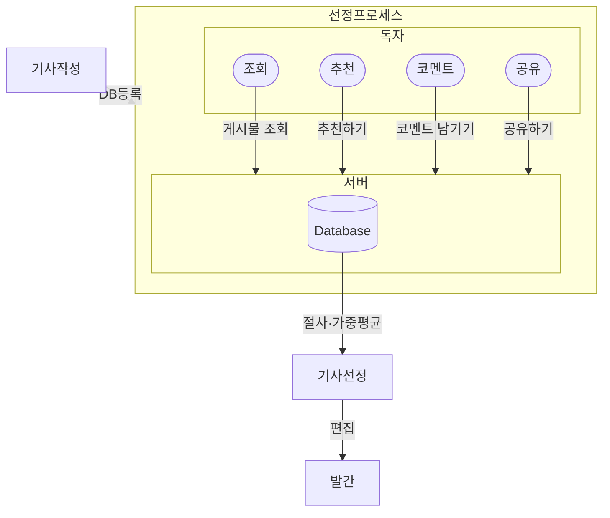

# 기능 정의서

프로젝트 정의서의 사용자 스토리를 기반으로 세부 기능을 구체적으로 정의합니다.

## 로그인 사용자(독자) 스토리

### (독자) 우리 지역만의 밀접하고 빠른 정보를 알고 싶습니다. 그래서 지역 주민으로서 지역의 이슈에 대해 즉각적으로 인지하고 있습니다.

#### 1. 위치 기반의 로그인, 회원가입 기능

- 기능 설명
  - 사용자(독자)는 회원가입 후, 로그인 시 위치 기반으로 지역의 소식을 확인할 수 있다.
- 입력 항목
  - 회원 ID : 고유 식별자
  - 닉네임 : 고유 식별자
  - 이름 : 문자열, 최대 50자
  - 연락처 : 문자열, 최대 15자 (유효성 검사 필요)
  - 이메일 : 문자열, 최대 50자 (유효성 검사 필요)
  - 가입날짜 (yyyy-mm-dd 형식)

##### 1.1 사용자 액션

##### 회원가입 및 로그인

- 회원가입 버튼 클릭
- 약관동의 버튼 클릭
- 개인정보 항목 입력
  - 입력 항목 유효성 검사 실행
  - 유효성 검사 오류 발생 시 등록 절차는 종료되며 사용자에게 오류 정보 알림
  - 유효성 검사 통과 시 등록 API 호출
  - API 호출 성공 후 요약 정보 표시
  - 로그인 화면으로 전환
    - 위치 기반 지역 인증

사용자 액선 1번(일반회원)

## 기사 업로드 사용자(기자) 스토리

### (기자) 우리 지역만의 이슈를 공유하고 싶습니다. 그래서 지역 주민 기자로서 활동하고 있습니다.

#### 1. 기능명: 지역 주민 인증 기능

- 기능 설명
  - 사용자는 모두 기자가 될 수 있으며 지역 인증을 한 사용자만 글을 쓸 수 있다.
  - 기사를 쓰는 사용자(기자)는 로그인 후 지역 인증을 한다.
- 입력 항목
  - 거주지 주소 : 문자열, 최대 100자

##### 1.1 사용자 액션

##### 기자등록

- 기자 등록 버튼 클릭
  - 이용약관 확인
- 약관 동의 버튼 클릭
- 개인 인증 확인 (지역 주민 인증)
  - 등록 프로세스
  - 등록 완료 후 메인 화면으로 전환 → 기사 작성 버튼 활성화 (생성)
  - 기자 레벨 0 부여.

사용자 액선 1번(기자등급 회원)

##### 기자등록 취소

- 기자 등록 취소 버튼 클릭
  - alert 창을 띄워 취소 여부 확인
- 최종 취소 버튼 클릭
  - 기자등록 취소 후 메인 화면으로 이동

#### 2. 기능명: 기사 업로드 템플릿 제공 기능

- 기능 설명
  - 사용자는 모두 기자가 될 수 있으며 지역 인증을 한 사용자만 글을 쓸 수 있다.
  - 플랫폼의 원칙과 추천수에 의한 기자별 레벨을 적용한다
- 입력 항목
  - 제목 : 문자열 최대 30자(유효성 검사)
  - 본문 : 문자열 최대 5000자
  - 이미지, 동영상: 최대 50MB(이미지 최대 3개, 동영상 최대 1개)
  - 해시태그: 최대 10개
  - 지역(어떤 동인지 선택): 셀렉트 박스 선택

##### 2.1 사용자 액션

##### 기사 작성 및 업로드

- 기사 업로드 버튼 클릭
- 제목 작성
- 본문 작성
- 업로드 버튼 클릭
  - 업로드 중 기사 삭제
    - alert 창을 띄워 삭제, 임시저장 여부 확인
    - 임시저장을 클릭할 시 임시 저장 리스트 화면으로 이동
    - 삭제 시 작성된 기사 삭제

##### 기사 임시 저장

- 임시 저장 버튼 클릭
- 임시 저장 리스트 화면으로 이동

##### 기사 수정

- 기사 수정 버튼 클릭
- 기사 작성 화면으로 이동

##### 기사 삭제

- 기사 삭제 버튼 클릭
  - alert 창을 띄워 삭제 여부 확인
- 최종 삭제 버튼 클릭
  - 기사 삭제 후 메인 화면으로 이동

사용자 액션 2.1번

## 추천 기사 사용자( 독자 / 기자 ) 스토리

### (독자) 우리 지역 최신 이슈를 놓치고 싶지 않아요. 다음날 조간신문 보듯이 이슈를 한 곳에 모아 놓은 뉴스를 보고 있습니다.

### (기자) 지역 이슈를 공유하다 보니 조간신문 핫 이슈 5에 선정되어 수익이 발생했어요. 더 좋은 이슈를 발굴하고자 노력하게 되었습니다.

#### 1. 기능명: 추천 기사 선정 기능

- 기능 설명
  - 조간신문에는 지역 광고를 받은 수익 창출, 수익을 선정된 기사의 작성자와 공유한다.
  - 플랫폼 독자와 상호 작용되는 조회수,추천,코멘트 수를 고려하여 선별한 5개의 기사를 선정한다.
- 입력 항목
  - 조회수: 숫자 +1(중복 카운트)
  - 추천: 숫자 +1(비중복 카운트)
  - 코멘트: 문자열, 최대 100자
  - 기사 공유: 숫자 +1(비중복 카운트)

##### 1.1 사용자 액션

##### 기사클릭

- 게시물 조회

##### 추천하기

- 추천 버튼 클릭

##### 코멘트하기

- 코멘트 창에 의견 쓰기
- 의견 등록
- 의견 삭제

##### 기사 공유 하기

- 공유하기 버튼 클릭
- URL 복사 / SNS 연동 버튼 클릭

##### 추천 기사 노출

- 조간 신문 형식으로 메인 노출

사용자 액션 3번

